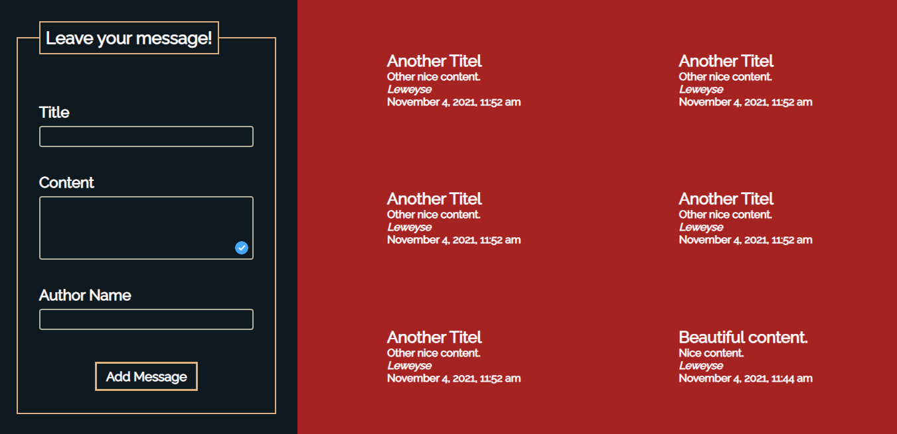

# Title: OOP: GuestBook
### PHP Exercise 03/11/2021

## Description
GuestBook with OOP (Object Oriented Programming).

## The Mission
Let's remember the internet of the 1990, and create a classic widget that every site in that decade had: a guestbook.

## Features
- Interacting with User (input).
- Saving information in json file.
- Dynamic components to display information.
- Displaying limited number of messages.
- Status boxes.
- Profanity filter.
- Replaced emotes.

## To Do

- [x] Use at least 2 classes: PostLoader & Post.
- [x] The messages are sorted from new (top) to old (bottom).
- [x] Make sure the script can handle site defacement attacks: use htmlspecialchars().
- [x] Only show the latest 20 posts.
- [x] Profanity filter: at the top of your script create an array of "bad" words. If somebody tries to enter a message with those words, their messages gets rejected.
- [x] When the user enters uses a "smily" like ":-)", ";-)", ":-(" replace it with an image of such a smily.

